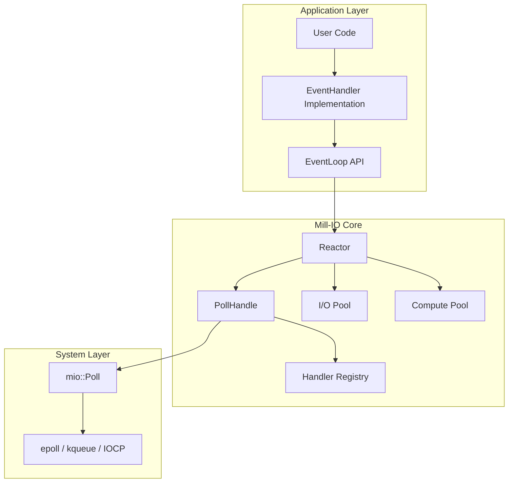
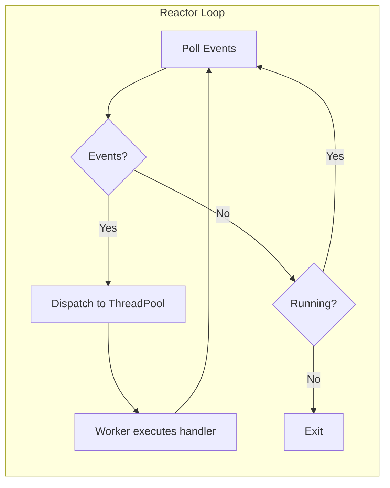
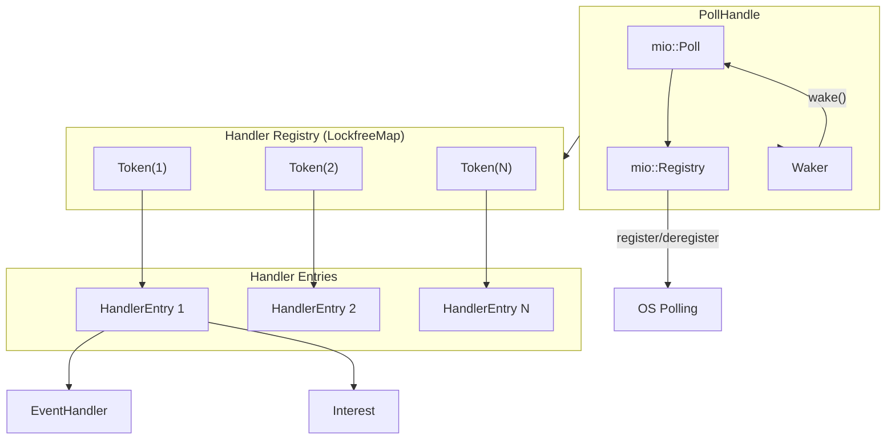
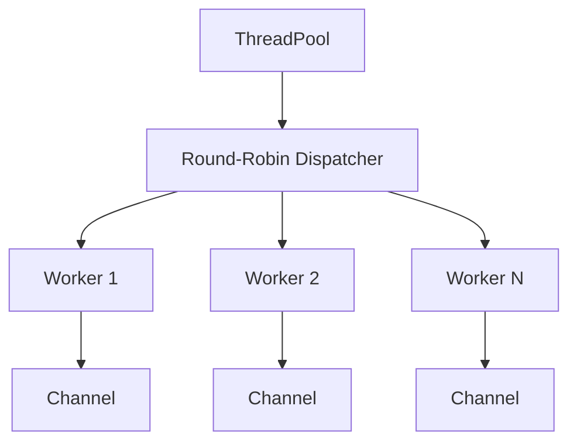
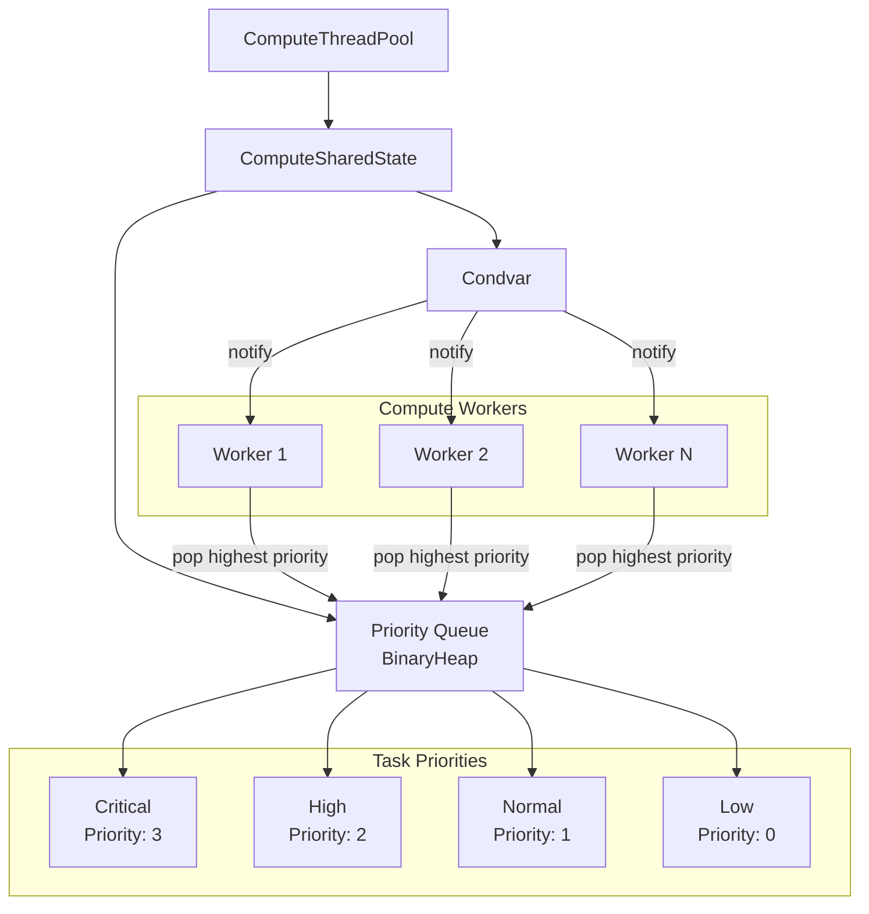
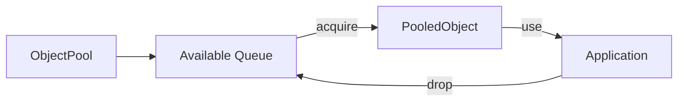
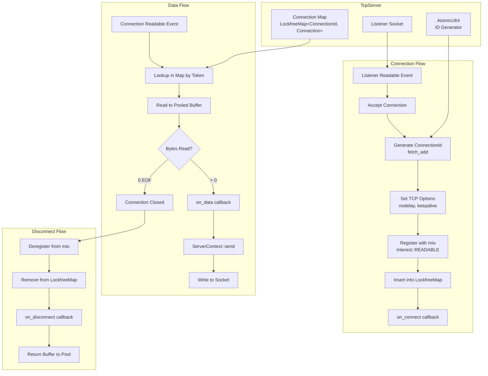
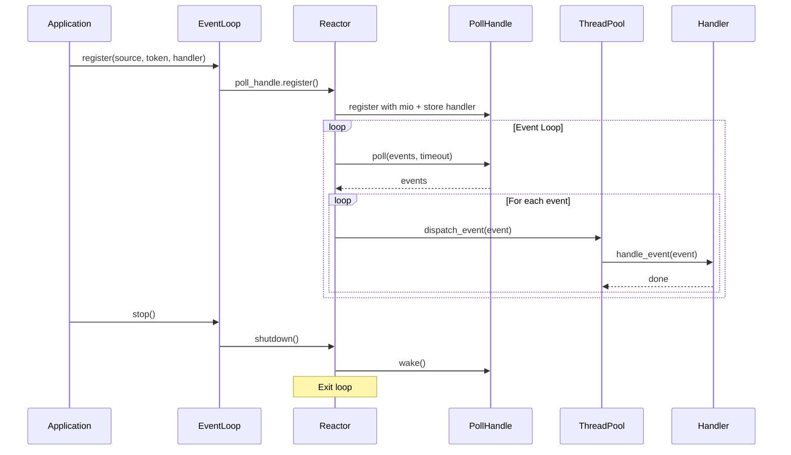

# Mill-IO Architecture

This document provides a comprehensive overview of Mill-IO's architecture, design decisions, and internal components.

## Overview

Mill-IO is built around a reactor pattern that efficiently manages I/O events using platform-specific polling mechanisms. The architecture separates concerns into distinct layers: the application layer where users implement their handlers, the Mill-IO core that coordinates event processing, and the system layer that interfaces with the operating system's polling infrastructure.



## Core Components

### EventLoop

The EventLoop serves as the main entry point and public API for Mill-IO. It wraps the Reactor and exposes a simple interface for registering I/O sources, starting the event loop, and managing shutdown. Users interact exclusively with EventLoop, which delegates all internal work to the Reactor. This separation keeps the public API stable while allowing internal implementation changes.

```rust
pub struct EventLoop {
    reactor: Reactor,
}
```

### Reactor

The Reactor is the heart of Mill-IO, coordinating the entire event processing pipeline. It continuously polls for I/O events, dispatches them to worker threads, and manages the event loop lifecycle. The Reactor holds references to the PollHandle for event detection, a ThreadPool for I/O event handling, a ComputeThreadPool for CPU-intensive tasks, and an atomic flag for graceful shutdown.

```rust
pub struct Reactor {
    poll_handle: PollHandle,
    events: Arc<RwLock<Events>>,
    pool: ThreadPool,
    compute_pool: ComputeThreadPool,
    running: AtomicBool,
    poll_timeout_ms: u64,
}
```

The main loop in the Reactor polls for events with a configurable timeout, then iterates through each event and dispatches it to the thread pool. Worker threads look up the appropriate handler from the registry and invoke its `handle_event` method. This continues until the running flag is set to false via the shutdown mechanism.



### PollHandle

PollHandle wraps mio's Poll with additional functionality for handler management. It maintains a lockfree map that associates each Token with its corresponding handler entry. When a source is registered, PollHandle registers it with mio and stores the handler in the registry. During event processing, handlers are retrieved by Token in O(1) time. The Waker allows external threads to interrupt the poll, enabling graceful shutdown from any context.

```rust
pub struct PollHandle {
    poller: Arc<RwLock<mio::Poll>>,
    mio_registry: mio::Registry,
    registry: Arc<Map<Token, HandlerEntry>>,
    waker: Arc<mio::Waker>,
}
```



### Thread Pools

Mill-IO uses two separate thread pools to handle different types of work. The I/O ThreadPool processes network events using round-robin dispatch across workers. Each worker receives tasks through a dedicated channel, ensuring fair distribution and preventing contention. The pool size is configurable and defaults to the number of available CPU cores.

```rust
pub struct ThreadPool {
    workers: Vec<Worker>,
    senders: Vec<channel::Sender<WorkerMessage>>,
    next_worker: AtomicUsize,
}
```



The ComputeThreadPool handles CPU-intensive operations that would otherwise block the I/O event loop. It implements priority scheduling using a binary heap, ensuring that critical tasks execute before lower-priority work. Workers wait on a condition variable and wake when tasks are available. This separation prevents compute-heavy operations from starving I/O processing.

```rust
pub struct ComputeThreadPool {
    workers: Vec<JoinHandle<()>>,
    state: Arc<ComputeSharedState>,
    sequence: AtomicU64,
    metrics: Arc<ComputePoolMetrics>,
}
```



Task priorities range from Low to Critical, with tasks of equal priority processed in FIFO order based on a sequence number. The pool tracks metrics including tasks submitted, completed, failed, active workers, queue depths by priority, and total execution time.

### ObjectPool

The ObjectPool reduces allocation overhead for frequently used objects like I/O buffers. It maintains a channel-based queue of reusable objects. When acquire is called, the pool returns an existing object if available or creates a new one using the provided factory function. The returned PooledObject automatically returns to the pool when dropped, enabling transparent recycling without explicit release calls.

```rust
pub struct ObjectPool<T> {
    sender: channel::Sender<T>,
    receiver: Arc<Mutex<channel::Receiver<T>>>,
    create_fn: Arc<dyn Fn() -> T + Send + Sync>,
}
```



## High-Level TCP Networking

The TCP module provides connection management abstractions built on Mill-IO's event loop. TcpServer accepts incoming connections and manages their lifecycle using a lockfree map keyed by ConnectionId. Each connection gets a unique identifier generated atomically, and connection state is stored without blocking concurrent access from worker threads.



The NetworkHandler trait defines callbacks for connection events. Implementations receive a ServerContext that provides methods for sending data to connections, broadcasting to all connections, and closing connections. The context holds weak references to avoid circular dependencies.

## Event Processing Flow

When an application registers an I/O source, the EventLoop forwards the request to the Reactor's PollHandle. The PollHandle registers the source with mio using the provided Token and Interest, then stores the handler in the lockfree registry. From this point, the source will generate events that flow through the system.

The Reactor's main loop calls poll on the PollHandle, which blocks until events are available or the timeout expires. For each event, the Reactor dispatches to the I/O ThreadPool. A worker thread retrieves the handler from the registry using the event's Token, checks that the event matches the registered interest, and invokes handle_event.



## Design Decisions

Mill-IO uses the reactor pattern rather than proactor because it provides a simpler mental model where applications explicitly handle events as they occur. This approach gives better control over when I/O operations happen and avoids the callback complexity common in proactor designs. The explicit nature of the reactor pattern also makes performance more predictable.

The thread pool uses a simple round-robin dispatch with per-worker channels rather than work-stealing queues. This design is easier to reason about and leverages Rust's optimized channel implementations. For most workloads, the slight imbalance from round-robin is negligible compared to the reduced complexity.

The handler registry uses a lockfree map to enable concurrent access without blocking. Event polling happens frequently, and handler lookup occurs for every event, so lock-free reads are essential for performance. The registry supports O(1) lookups by Token and allows concurrent registration and deregistration.

Object pooling addresses the allocation overhead of I/O buffers. Network applications frequently allocate and deallocate buffers for reading and writing. The pool amortizes these costs by reusing buffers across operations. The default buffer size of 8KB balances memory usage with typical packet sizes.

## Platform Support

Mill-IO delegates platform-specific polling to mio, which provides a unified interface across operating systems. On Linux, mio uses epoll with edge-triggered notifications for efficient high-connection scenarios. macOS and BSD systems use kqueue, which offers kernel-level event filtering. Windows uses I/O Completion Ports through mio's abstraction layer.

| Platform   | Polling Mechanism |
| ---------- | ----------------- |
| Linux      | epoll             |
| macOS, BSD | kqueue            |
| Windows    | IOCP              |

## Configuration

The EventLoop accepts configuration for the number of worker threads, event buffer capacity, and poll timeout. The default configuration uses the number of available CPU cores for workers, a 1024-event buffer, and a 150ms poll timeout. Applications can tune these values based on their workload characteristics.

```rust
// Default configuration
let event_loop = EventLoop::default();

// Custom configuration
let event_loop = EventLoop::new(
    8,      // Worker threads
    2048,   // Event buffer capacity
    50      // Poll timeout in milliseconds
)?;
```

For TCP servers, TcpServerConfig provides additional options including buffer size, maximum connections, TCP_NODELAY setting, and keep-alive duration. The builder pattern enables ergonomic configuration with sensible defaults.

```rust
let config = TcpServerConfig::builder()
    .address("0.0.0.0:8080".parse().unwrap())
    .buffer_size(16384)
    .max_connections(10000)
    .no_delay(true)
    .build();
```
