# Mill-IO Architecture

This document provides a comprehensive overview of Mill-IO's architecture, design decisions, and internal components.

## Overview

Mill-IO is built around a **reactor pattern** that efficiently manages I/O events using platform-specific polling mechanisms. The architecture separates concerns into distinct layers while maintaining high performance and low overhead.


## Core Components

### 1. EventLoop - Public API

The `EventLoop` is the main entry point that provides a clean interface for users:

```rust
pub struct EventLoop {
    reactor: Reactor,
}
```

**Responsibilities:**
- Expose simple registration/deregistration API
- Manage reactor lifecycle
- Provide shutdown mechanisms

### 2. Reactor - Event Loop Coordinator

The `Reactor` orchestrates the entire event processing pipeline:


```rust
pub struct Reactor {
    poll_handle: PollHandle,
    events: Arc<RwLock<Events>>,
    pool: ThreadPool,
    running: AtomicBool,
    poll_timeout_ms: u64,
}
```

**Responsibilities:**
- Main event loop execution
- Event polling coordination
- Task dispatching to thread pool
- Graceful shutdown handling

### 3. PollHandle - I/O Polling Abstraction

Wraps `mio::Poll` with handler management:

```mermaid
graph TD
    A[PollHandle] --> B[mio::Poll]
    A --> C[Handler Registry]
    A --> D[Waker]
    
    B --> E[Platform Polling]
    C --> F[Token → Handler Mapping]
    D --> G[External Wake Events]
```



```rust
pub struct PollHandle {
    poller: Arc<RwLock<mio::Poll>>,
    registry: Registry,
    waker: Arc<mio::Waker>,
}
```

**Responsibilities:**
- Source registration/deregistration
- Event polling with timeouts
- Handler registry management
- Wake-up mechanism for shutdown

### 4. ThreadPool - Task Execution

Manages worker threads for handling I/O events:


```rust
pub struct ThreadPool {
    workers: Vec<Worker>,
    sender: channel::Sender<WorkerMessage>,
}
```

**Features:**
- Configurable worker count
- Work-stealing via shared channel
- Graceful shutdown with termination messages
- Support for both stable MPSC and unstable MPMC channels

### 5. ObjectPool - Memory Management

Reduces allocation overhead for frequently used objects:


```rust
pub struct ObjectPool<T> {
    sender: channel::Sender<T>,
    receiver: Arc<Mutex<channel::Receiver<T>>>,
    create_fn: Arc<dyn Fn() -> T + Send + Sync>,
}
```

**Benefits:**
- Amortizes allocation costs
- Automatic object lifecycle management
- Thread-safe acquire/release
- Configurable object creation

## Event Processing Flow

The complete event processing pipeline:


## Design Decisions

### 1. Reactor Pattern Choice

**Why Reactor over Proactor?**
- Simpler mental model: explicit event handling
- Better control over when and how I/O operations occur
- Avoids callback hell common in proactor patterns
- More predictable performance characteristics

### 2. Thread Pool Integration

**Why not single-threaded?**
- I/O events often require CPU-intensive processing
- Thread pool prevents blocking the main event loop
- Allows scaling across multiple CPU cores
- Provides isolation between different event handlers

**Why shared channel over work-stealing queues?**
- Simpler implementation with good performance
- Built-in Rust channel optimizations
- Easy to reason about task distribution
- Future: can be extended with work-stealing if needed

### 3. Handler Registry Design

Uses lockfree map for handler storage:

```rust
type Registry = Arc<Map<Token, HandlerEntry>>;
```

**Benefits:**
- Lock-free reads for high-frequency polling
- Concurrent handler registration/deregistration
- O(1) handler lookup by token

### 4. Memory Management Strategy

**Object Pooling for Buffers:**
- I/O operations frequently allocate/deallocate buffers
- Pool amortizes allocation costs across requests
- Automatic sizing for common buffer sizes (8KB default)

## Platform-Specific Considerations

### Linux (epoll)
- Edge-triggered notifications for efficiency
- Batch event processing via `epoll_wait`
- Efficient for high connection counts

### macOS/BSD (kqueue)
- Event filtering at kernel level
- Fine-grained event control
- Good performance characteristics

### Windows (IOCP)
- Completion-based model via mio's abstraction
- Automatic scaling with system resources

## Performance Characteristics

### Latency
- **Event detection**: Sub-millisecond (depends on poll timeout)
- **Handler dispatch**: Minimal overhead via direct function calls
- **Thread pool**: Queue-based task distribution

### Throughput
- **Concurrent connections**: Limited by OS file descriptor limits
- **Event processing**: Scales with thread pool size
- **Memory usage**: Bounded by object pool configuration

### Scalability
- **Horizontal**: Multiple event loops per process
- **Vertical**: Configurable thread pool sizing
- **Memory**: O(connections) for handler registry

## Configuration Options

### EventLoop Construction
```rust
// Default configuration
let event_loop = EventLoop::default();

// Custom configuration
let event_loop = EventLoop::new(
    workers: 8,           // Thread pool size
    events_capacity: 2048, // Event buffer size
    poll_timeout_ms: 100  // Polling timeout
)?;
```

### Feature Flags
- `unstable-mpmc`: Multi-producer, multi-consumer channels
- `unstable`: All experimental features

## Error Handling Strategy

Mill-IO uses a layered error handling approach:

1. **System Errors**: I/O errors are propagated from mio
2. **Logic Errors**: Configuration and usage errors  
3. **Recovery**: Graceful degradation where possible
4. **Logging**: Errors are returned, not logged internally

## Future Architecture Evolution

### Planned Enhancements

1. **Timer Wheel**: Efficient timeout management


2. **Connection Pooling**: Reusable connection management
3. **Backpressure**: Flow control mechanisms
4. **Metrics**: Performance monitoring hooks

### Potential Optimizations

- **NUMA Awareness**: Thread pool binding for large systems
- **io_uring**: Linux-specific high-performance I/O
- **User-space Networking**: Bypass kernel for specialized cases

